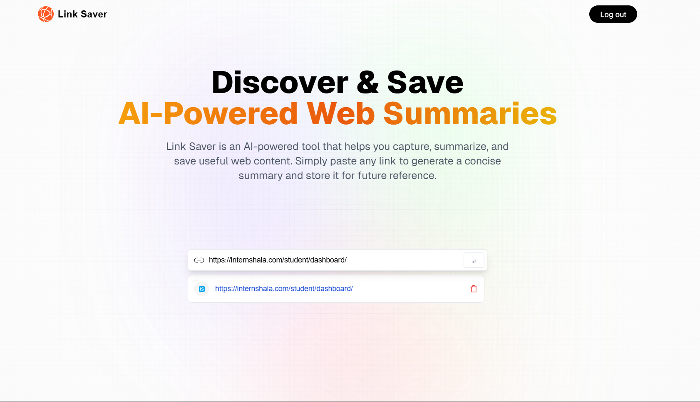
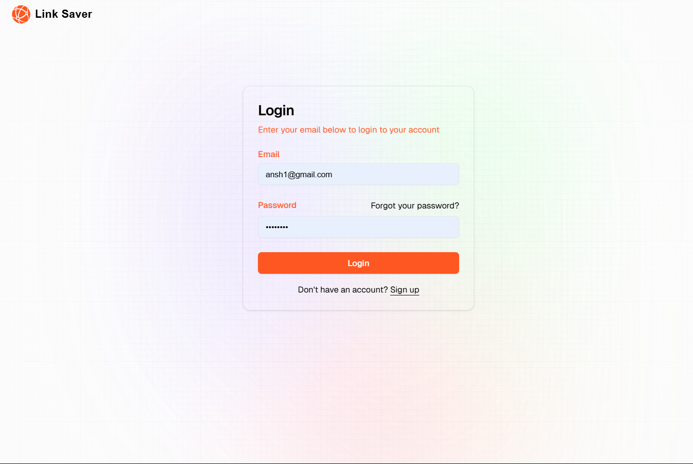
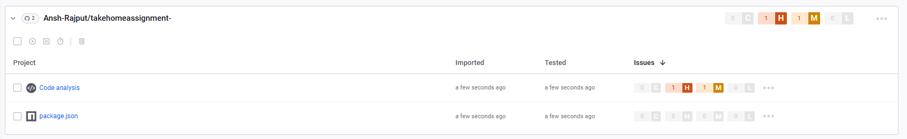

# 🔗 Link Summarizer

A **Next.js** application that accepts any URL, generates its AI-powered summary, and stores metadata like the favicon, URL, and summary using **Supabase** as the backend.

---

## 🛠️ Tech Stack

- **Frontend:** Next.js (App Router)
- **Backend & Database:** Supabase (PostgreSQL + Supabase Auth)
- **Authentication:** Supabase Auth (Email login)
- **Styling:** Tailwind CSS
- **Data Fetching:** Fetch API (using Jina AI for summarization)

---

## ⚙️ Setup Instructions

### 1. Clone Repository

```bash
git clone https://github.com/Ansh-Rajput/takehomeassignment-.git
cd link-summarizer
```

### 2. Install Dependencies

```bash
npm install
```

### 3. Configure Environment Variables

Create a `.env.local` file in the project root with:

```env
NEXT_PUBLIC_SUPABASE_URL=your_supabase_project_url
NEXT_PUBLIC_SUPABASE_ANON_KEY=your_supabase_anon_key
```

### 4. Run the Application

```bash
npm run dev
```

### 5. Supabase Setup

- Create a Supabase project.
- Inside Supabase SQL Editor or Table View, create a table named `posts` with the following columns:

| Column  | Type               |
| ------- | ------------------ |
| id      | uuid (Primary Key) |
| user_id | uuid               |
| url     | text               |
| favicon | text               |
| summary | text               |

- Enable Supabase Auth (start with email authentication).

---

## ✅ Features

- 🔗 Accepts URL input.
- ⚡ Fetches AI-generated summary for the URL.
- 🖼️ Automatically fetches and stores the favicon of the URL.
- 📄 Stores URL, favicon, and summary into Supabase database.
- 🗜️ Displays saved URLs in history with their favicon and truncated URL.
- 🔐 Supports basic email authentication via Supabase.

---

## 🛧 What I'd Do Next

- **Tag Extraction:** Automatically extract tags or keywords from summaries and store them for better organization and filtering.
- **Filtering System:** Enable users to filter saved URLs based on tags, categories, or creation date.
- **OAuth Login:** Integrate Google/GitHub login using Supabase OAuth.
- **Proper Error Handling:** Display meaningful error messages (e.g., API errors, validation errors) directly to users instead of console logs.
- **Loading & UX Improvements:** Add skeleton loaders, empty states, and improve feedback during network requests.
- **Rate Limiting:** Implement basic rate limiting to prevent excessive API usage or abuse.
- **Pagination/Infinite Scroll:** Improve scalability for displaying large history lists.

---

## ⏳ Time Spent

> Approximately **3–4 hours** spent building:
>
> - Project setup using Next.js + Supabase
> - Implementing URL summary generation
> - Favicon extraction
> - Database integration and authentication
> - Basic history view and user interface

---

## 📷 Screenshots

### 🏠 Home Page



---

### 🔐 Login Page



---

### 🛡️ Snyk Security Scan



## 📄 License

MIT License. Free to use and modify.
